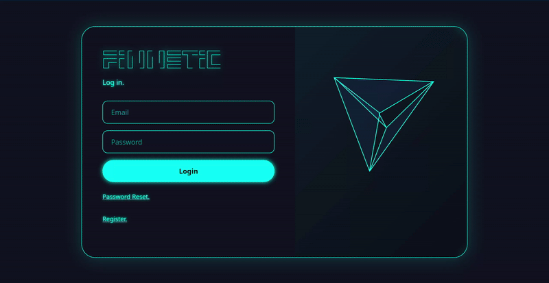

**Auth Modal (Login / Register / Reset Password)**



This modal provides authentication with login, registration, and password reset functionality.

It is ready for backend integration. You can easily connect it with an API or reuse backend logic from existing projects (e.g., Trading-Simulation-Platform-CRM).

Login Modal – Email + Password authentication form

Registration Modal – Email + Password user registration

Password Reset Modal – Email 

Lottie Animations 

Responsive Design – Works on desktop and mobile

Backend-Ready – Prepared for API integration (login.js handles modal switching and actions)


**Structure**
```
├── login.html       # Core HTML structure for modals
├── login.css        # Styling (futuristic neon UI)
├── login.js         # JavaScript logic (modal switching, event handling)
├── assets/
│   └── logo.png     # Placeholder logo
└── Shot-2025-09-27.png # Screenshot of the UI
```
**Clone**
```bash
git clone https://github.com/NT411/Simple-LogIn-Register-ResetPass-Modal.git
```
Open login.html with VScode live server or any live server otherwise the Lottie Animation will not work
  
Connect to Backend

The modal is frontend-only by default. To integrate:

Use login.js to capture form data.

Connect form submissions to your backend API.

Replace placeholder console.log actions with actual HTTP requests (fetch/axios).

**Customization**

Styling: Edit login.css to adjust colors, fonts, or animations.

Logo: Replace assets/logo.png with your own branding.

Animations: Update the Lottie JSON paths inside login.html.

Validation: Extend login.js with form validation before sending requests.
   
